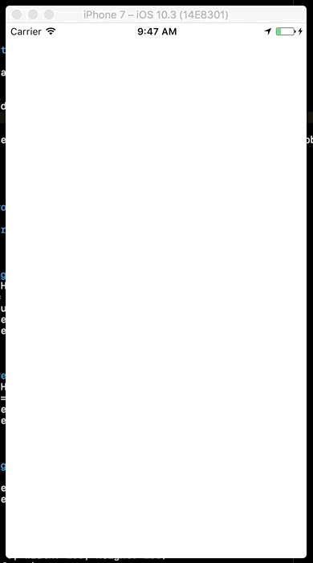
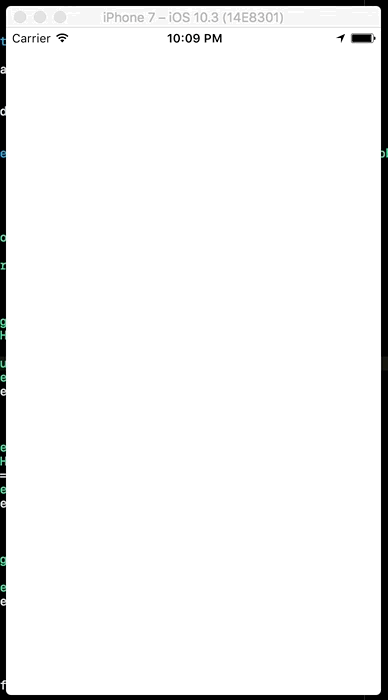

# RGProgressHUD

RGProgressHUD is an iOS progress HUD written in Swift. You can configure it with three modes - `normal`, `blur` & `custom`. It allows you to change appreance of various UI aspects like `tintColor`, `backgroundColor`, `alpha` etc.

## Example

```swift
let hud = RGProgressHUD()

// there are two ways to show
hud.show()
hud.show(on: view)

// one function to hide
hud.hide()
```

||
:-:|:-:|:-:


### Normal mode
It's the most commonly used mode which shows a loader with a translucent overlay. You can update a couple of UI aspects, checkout [`RGProgressHUDAppearance`](Source/RGProgressHUDAppearance.swift) for more info.
 
```swift
		
	func basicHUD() -> RGProgressHUD {
		return RGProgressHUD()
	}

	func differentTintHUD() -> RGProgressHUD {
		let appearance = RGProgressHUDAppearance()
		appearance.indicatorColor = .yellow
		let mode = RGProgressHUDMode.normal(appearance)
		
		let hud = RGProgressHUD(mode: mode)
		return hud
	}
```

### Blur mode
It allows you to add a loader with full screen blurred background. You can update a couple of UI aspects, checkout [`RGProgressHUDAppearance`](Source/RGProgressHUDAppearance.swift) for more info.

```swift

	func blurHUD() -> RGProgressHUD {
		let appearance = RGProgressHUDAppearance()
		appearance.blurEffectStyle = .dark
		let mode = RGProgressHUDMode.blur(appearance)
		
		let hud = RGProgressHUD(mode: mode)
		return hud
	}
```

### Custom mode
It allows you to add a custom view as a loader. This mode only animates the show/hide of your custom view, rest everything is your responsibility.

```swift

	func customHUD() -> RGProgressHUD {
		let loader = customLoader
		let mode = RGProgressHUDMode.custom(loader)
		let hud = RGProgressHUD(mode: mode)
		return hud
	}

	var customLoader: UIView {
		let frame = CGRect(x: 0, y: 0, width: 100, height: 100)
		let loader = UIView(frame: frame)
		loader.center = view.center
		loader.backgroundColor = .red
		return loader
	}

...
```

## Installation

### Cocoapods

To integrate RGProgressHUD into your Xcode project using CocoaPods, specify it in your Podfile:

```
pod 'RGProgressHUD', :git => 'https://github.com/riteshhgupta/RGProgressHUD.git'
```


## Internal Architecture

There are primarily three classes used in RGProgressHUD,

- [`RGProgressHUD`](Source/RGProgressHUD.swift) - it's the main class which you will have to use to create huds.
- [`RGProgressHUDAppearance`](Source/RGProgressHUDAppearance.swift) - it allows you to configure the UI of a hud.
- [`RGProgressHUDMode`](Source/RGProgressHUDMode.swift) - it allows you set the kind of hud you want to create like normal, blurred or custom.

There are couple of [examples](RGProgressHUD/ViewController.swift) in the project itself which you can checkout or create an issue or ping [me](https://twitter.com/_riteshhh) if anything comes up 👍


## Contributing

Contributions are welcome and encouraged! Open an [issue](https://github.com/riteshhgupta/RGProgressHUD/issues/new) or submit a [pull request](https://github.com/riteshhgupta/RGProgressHUD/compare) 🚀

## Licence

RGProgressHUD is available under the MIT license. See the LICENSE file for more info.